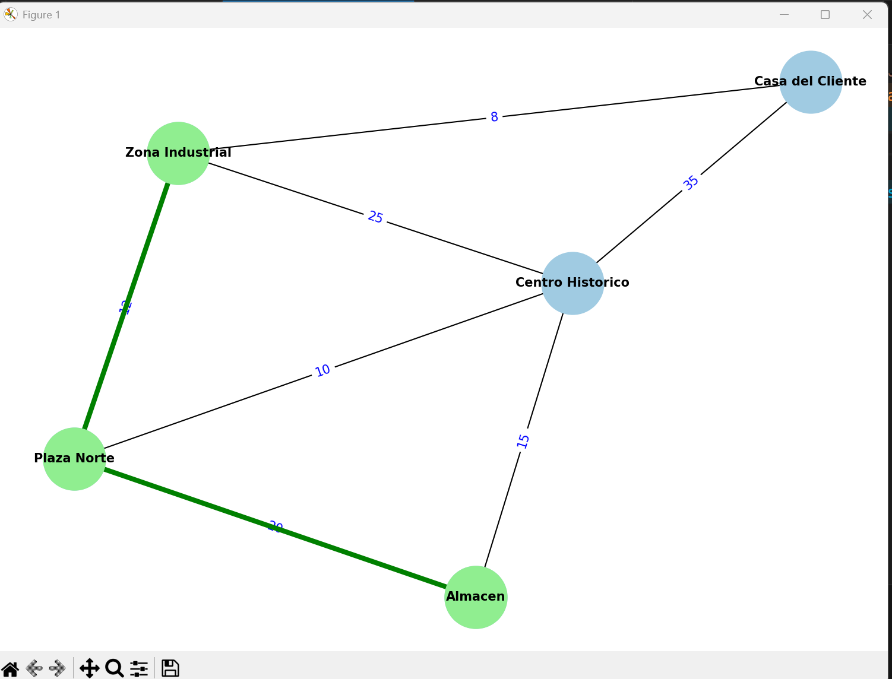

# Implementación Práctica de Algoritmos de Inteligencia Artificial
**Materia:** Sistemas Expertos / Inteligencia Artificial

Este repositorio contiene la adaptación de algoritmos clásicos de búsqueda y optimización en grafos hacia **casos de uso reales y cotidianos**. El objetivo de este proyecto es demostrar cómo la Inteligencia Artificial y las estructuras de datos pueden resolver problemas logísticos, de infraestructura y de telecomunicaciones del mundo real.

Todos los algoritmos incluyen una interfaz interactiva en consola y una **simulación gráfica animada** utilizando `NetworkX` y `Matplotlib`.

---

## 1. Algoritmo de Dijkstra: Sistema de Navegación (GPS) Logístico
El algoritmo de Dijkstra clásicamente encuentra el camino más corto entre dos nodos. 

**Implementación Real:** Se adaptó para funcionar como el motor de enrutamiento de un sistema GPS para repartidores. 
* **Nodos:** Representan ubicaciones clave en una ciudad (Almacén, Casa del Cliente, Centro Histórico).
* **Aristas (Pesos):** Representan el tiempo en minutos que toma viajar entre dos puntos, simulando el tráfico.
* **Funcionamiento:** El usuario ingresa su punto de partida y su destino. La IA evalúa todas las rutas posibles, descarta los embotellamientos y devuelve el itinerario con el menor tiempo total estimado, graficando la ruta óptima en verde.

---

##  2. Algoritmo de Prim: Planificador de Red de Fibra Óptica (Árbol de Expansión Mínima)
Prim es un algoritmo codicioso (greedy) que busca conectar todos los nodos de un grafo minimizando el costo total, partiendo desde un nodo inicial.

**Implementación Real:**
Se diseñó un simulador para ingenieros de telecomunicaciones que necesitan tender una red de fibra óptica en un campus o ciudad.
* **Nodos:** Representan los edificios o sucursales que necesitan conexión a internet.
* **Aristas (Pesos):** Representan los metros de cable de fibra óptica necesarios para unir dos edificios.
* **Funcionamiento:** El usuario ingresa el plano (edificios y distancias) y elige dónde instalar el "Servidor Principal". La IA calcula paso a paso qué edificios conectar para garantizar que toda la red tenga internet utilizando la **menor cantidad de cable posible**, ahorrando presupuesto.

---

##  3. Kruskal Mínimo: Constructor de Carreteras Estatales
Al igual que Prim, Kruskal Mínimo busca un Árbol Parcial Mínimo, pero lo hace ordenando globalmente todas las conexiones de menor a mayor y evitando formar ciclos (anillos cerrados).

**Implementación Real:**
Un sistema para la Secretaría de Obras Públicas encargado de pavimentar rutas entre ciudades.
* **Nodos:** Representan ciudades o municipios aislados.
* **Aristas (Pesos):** Representan los kilómetros de distancia entre ellas.
* **Funcionamiento:** Evalúa todos los proyectos de carreteras propuestos, empezando por los tramos más cortos. Utiliza una estructura `Union-Find` para aprobar la construcción de carreteras que conecten nuevas zonas y rechazar (en rojo) aquellas que formen rutas redundantes, logrando conectar todo el estado con el mínimo de kilómetros pavimentados.

---

## 4. Kruskal Máximo: Diseño de Acueducto de Alto Flujo
El Kruskal Máximo invierte la lógica tradicional: busca conectar todos los elementos priorizando siempre los costos o pesos **más altos**.

**Implementación Real:**
Un optimizador para redes de distribución de agua potable (tuberías).
* **Nodos:** Representan tanques de agua o plantas de tratamiento.
* **Aristas (Pesos):** Representan la capacidad máxima de flujo de una tubería en **Litros por segundo (L/s)**.
* **Funcionamiento:** Para asegurar que el agua llegue a toda la red con la mejor presión posible, la IA ordena las tuberías de mayor a menor capacidad. Prioriza instalar los tubos más gruesos y rechaza las conexiones redundantes que usarían tubos delgados, garantizando la red de distribución más robusta.

---

## 🛠️ Requisitos para ejecutar
Para correr las simulaciones visuales, asegúrate de tener instaladas las siguientes librerías de Python:
- `networkx`
- `matplotlib`

Puedes instalarlas ejecutando:
`pip install networkx matplotlib`